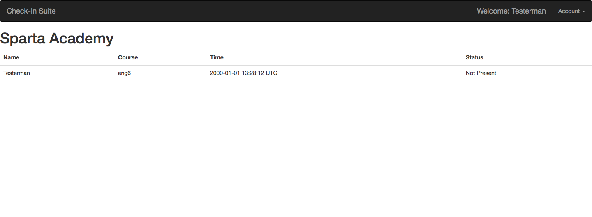
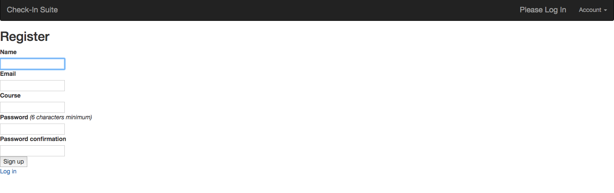
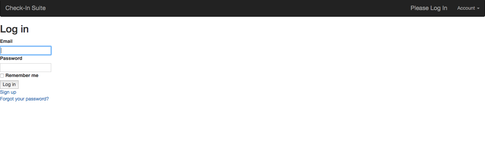
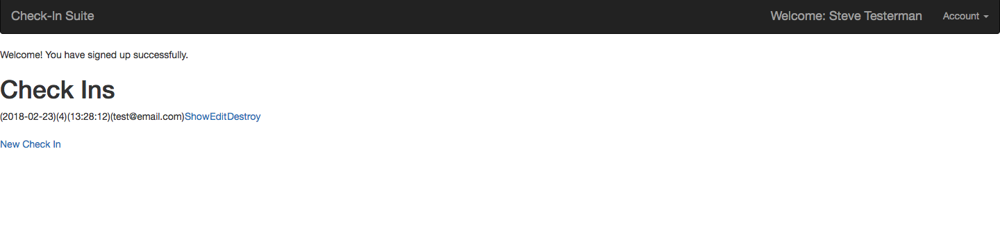
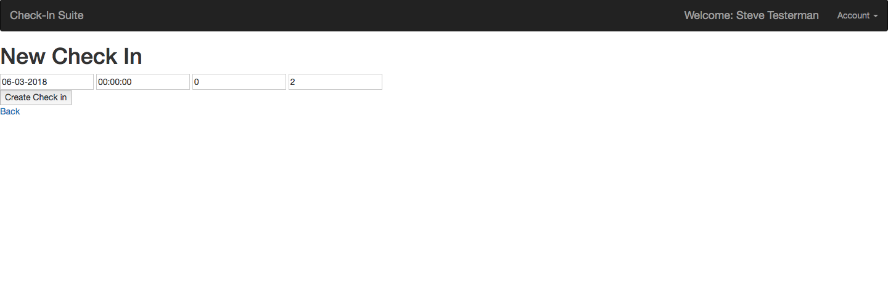

# 24 Hour Project - Academy Clock In / Out System

### Contents

- [Software and Dependencies](#software-and-dependencies)
- [Installation](#installation)
- [Requirements](#requirements)
- [Results](#results)
- [Screenshots](#screenshots)
- [Contributors](#contributors)

## Software and Dependencies

- [Ruby 2.5.0](https://www.ruby-lang.org/en/downloads/)
- [Rails 5.1.5](https://rubygems.org/gems/rails/versions/5.1.5)
- [Devise 4.4.1](https://rubygems.org/gems/devise)
- [Bootstrap-Sass 3.3.7](https://rubygems.org/gems/bootstrap-sass)
- [JQuery 4.3.1](https://rubygems.org/gems/jquery-rails/versions/4.3.1)

### Installation

Access the project repository at: [github.com/NBurns90/sparta-rails-mini-project](https://github.com/NBurns90/sparta-rails-mini-project).

Clone the repository by copying below into the desired directory:
`git clone git@github.com:NBurns90/sparta-rails-mini-project.git`.

Download all the depedent gems by running `bundle` command in the directory where the repository is stored.

Start the program by running `rails s` command in the directory where the repository is stored. Access the site using the URL `localhost/3000`

## Requirements

Create an academy attendance app using Rails. It should show a list of students currently enrolled in the academy, the course they're on and whether they're logged in.

Every day each student would login with their Sparta email and be taken to a dashboard where they can click a button that logs them in as present on the present date.

There should be time-bands associated with the login:

- before 9.30am = on time
- between 9.30 - 9.35 = slightly late
- after 9.35 = very late

The app must:

- have authentication
- be mobile responsive
- have a user model and academy model
- if not logged in, have an index that shows a list of all students and whether they've present
- be styled with Bootstrap

## Results

The requirements were met in the final product, however there currently is not any custom routing between the index and check in systems.

The basic index page is at the URL:
http://localhost:3000/

While the check in index is at the URL:
http://localhost:3000/check_ins

## Screenshots

Index Page, Logged in

Sign Up Page

Log In Page

Check Ins Index

New Check In

# Contributors

- [Nathaniel Burns](https://github.com/NBurns90)
- [Ben Robinson](https://github.com/bjorobinson)
- [Christian Bryant](https://github.com/cbryant93)
- [Mahboob Rahman](https://github.com/Mahboobr)
- [Muhammed-Rayhaan Uddin](https://github.com/MoRUddin)
